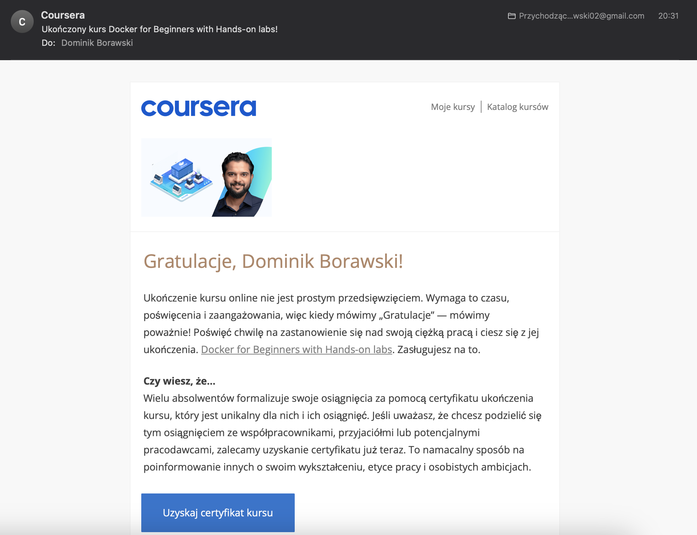

## Dominik Borawski - 24000

Zrzuty ekranu z każdego rozdziału kursu, średnio się progres zaznacza na filmach na courserze, albo to przez przyspieszenie filmu (lektor trochę za spokojnie mówi :)).

### Rozdział 1

### Rozdział 2

### Rozdział 3

### Rozdział 4

### Rozdział 5

### Rozdział 6

### Rozdział 7

### Rozdział 8

### Rozdział 9

### Rozdział 10

### Podsumowanie

