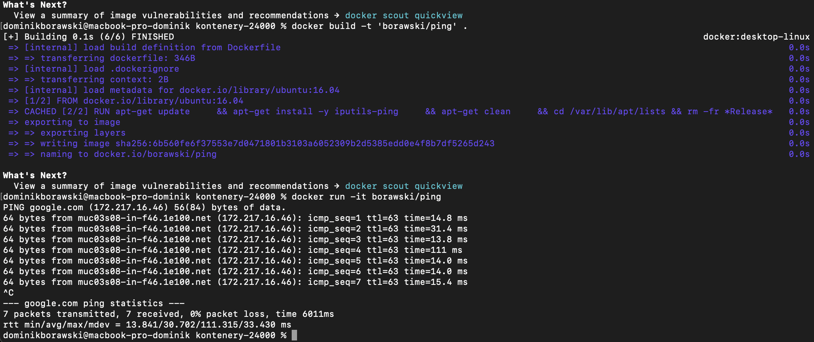

Dominik Borawski
215IC
B1

1. Lista obrazów w dockerze:

2. Docker search ubuntu

3. Docker pull ubuntu 22.04

4. Docker pull ubuntu 22.10

5. Docker images

6. Usuwanie obrazu po id

7. Sprawdzenie skutku usunięcia

8. Usuwanie wszystkich obrazów

9. Pobranie ubuntu 22.04 przy docker run

10. Wyświetlenie wszystkich kontenerów

11. Wyświetlenie wszystkich kontenerów

12. Docker run ubuntu

13. Docker ps po uruchomieniu kolejnego kontenera

14. Docker run i przejście do konsoli kontenera

15. ls w kontenerze

16. Docker run ze sleep

17. Kontener widoczny w docker ps bez flagi -a

18. Docker exec

19. Przejście do terminala kontenera

20. ps aux w kontenerze i docker ps

21. Zatrzymanie kontenera

22. Wyświetlenie wszystkich kontenerów

23. Wyświetlenie wszystkich kontenerów

24. Docker run z apt get i ping

25. Ciąg dalszy

26. Lista obrazów

27. Budowa obrazu z pingiem

28. Lista obrazów, w tym ping

29. Uruchomienie obrazu z pingiem

30. Otagowanie obrazu

31. Popchnięcie obrazu do repo

32. Docker run z httpd, curl na localhost

33. Skopiowanie strony

34. Curl na localhost

35. Podgląd sieci w dockerze

