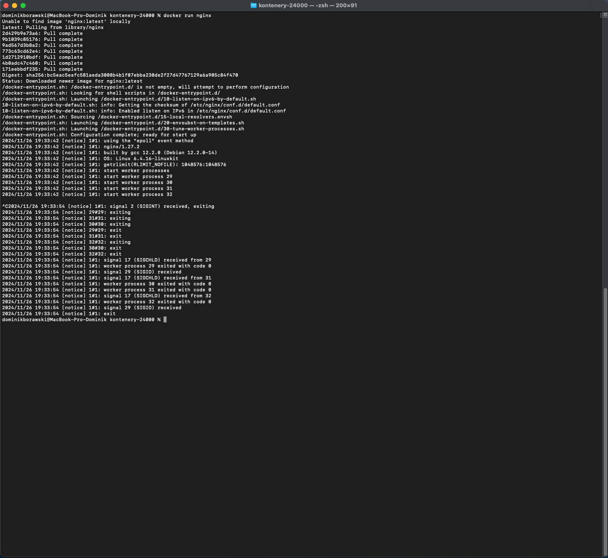
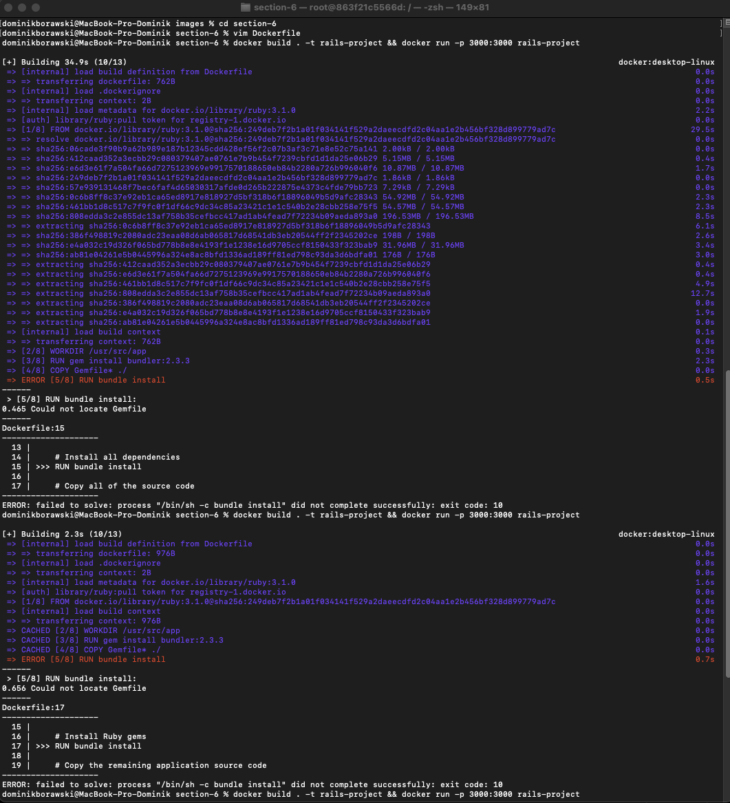

Przypomnienie materiału dotyczącego zarządzania kontenerami, obrazami oraz ogólnie dockera.

## section-1

1. Tworzenie kontenera

2. Lista kontenerów

3. Zarządzanie kontenerami #1

4. Zarządzanie kontenerami #2

5. Tworzenie kontenera z nginx #1

6. Tworzenie kontenera z nginx #2

7. Usuwanie kontenerów

## section-2

1. Kontener z looperem

2. Polecenie attach i exec

3. Czyszczenie loopera

4. Tworzenie kontenera ze skryptem

5. Kontener z curl

## section-3

1. Tworzenie kontenera z generatorem logów

2. Docker ps 

3. Sekretna wiadomość - skutek

4. Sekretna wiadomość - źródło

5. Budowa obrazu hello docker

6. Docker ps

7. Pobieranie obrazu, przenoszenie plików

8. docker diff

9. docker run

## section-4

1. Docker run z ubuntu #1

2. Docker run z ubuntu #2

3. Docker run z ubuntu #3

4. Działający kontener"

5. Kontener z pythonem

## section-5

1. Kontener z loggerem #1

2. Kontener z loggerem #2

## section-6

1. Część z railsem nie działała :(

