Całe laboratorium było prostym prowadzeniem w docker compose umożliwiające prostą integrację kontenerów ze sobą oraz zależności między nimi.   

## section-1

1. Budowa obrazu z docker compose
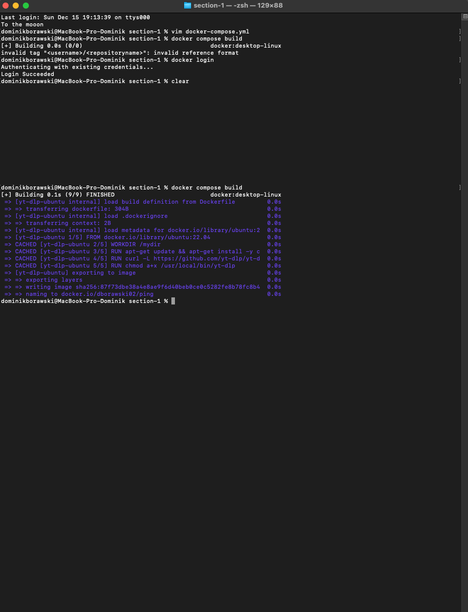

## section-2

1. Tworzenie wielu kontenerów z docker compose
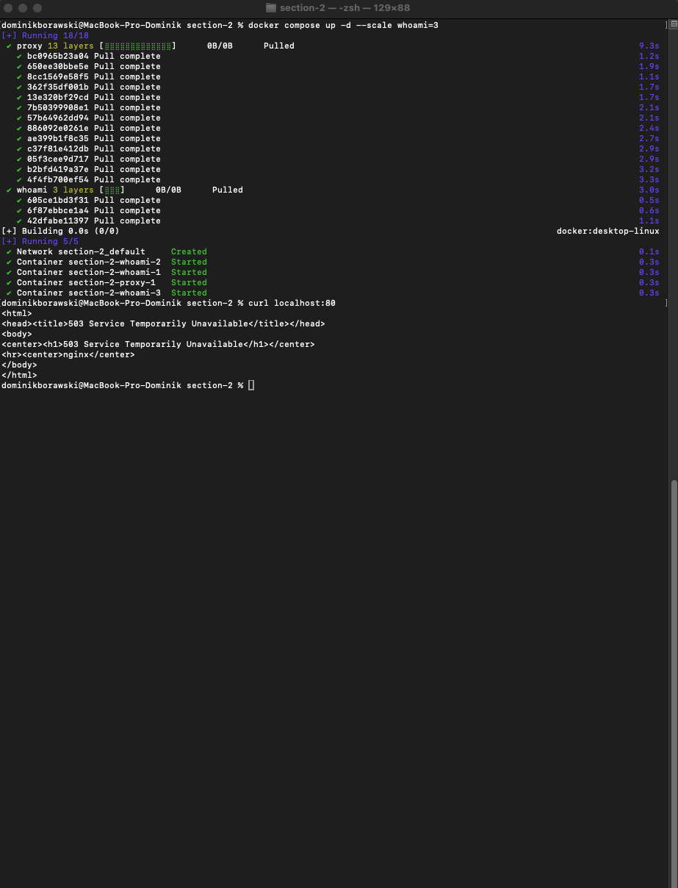

2. Zarządzanie kontenerami z docker compose
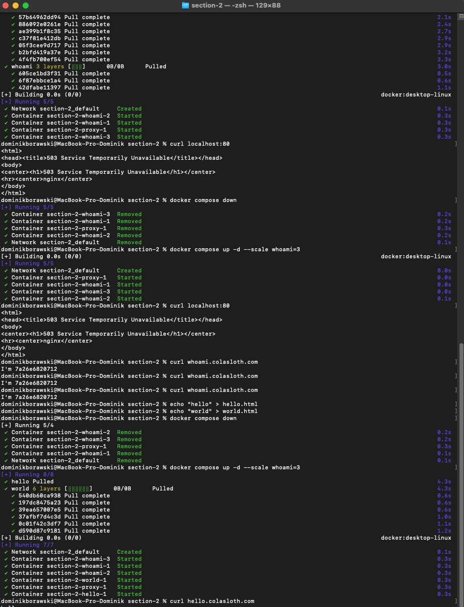

## section-3

1. Kontener z redmine #1:
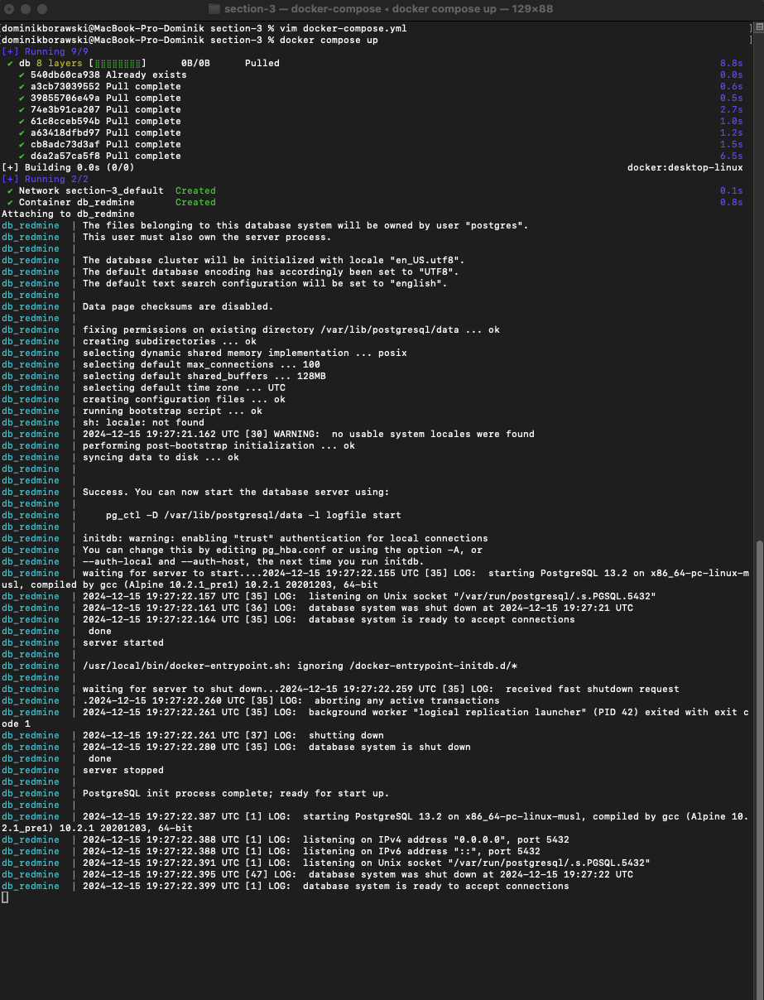

2. docker inspect dla mounts #1
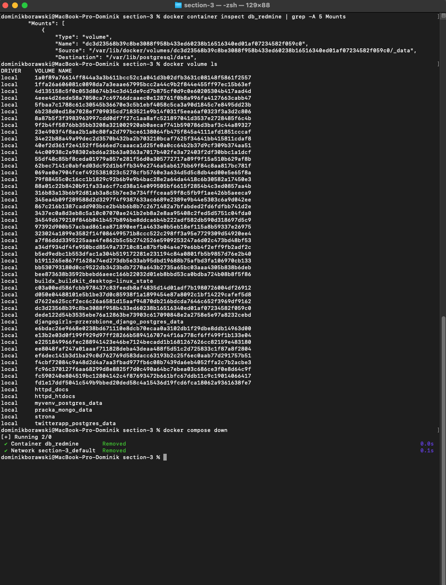

3. docker inspect dla mounts #2
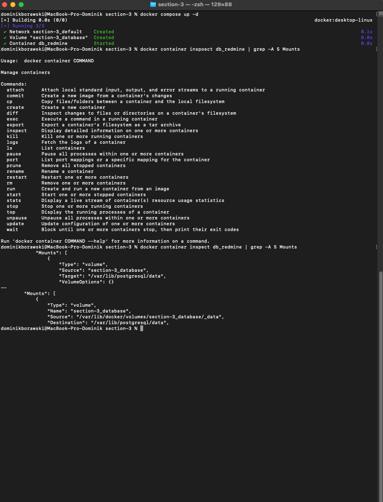

4. docker compose z sqlite #1
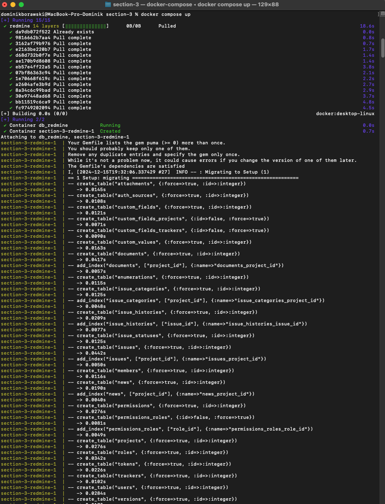

5. docker compose z sqlite #2
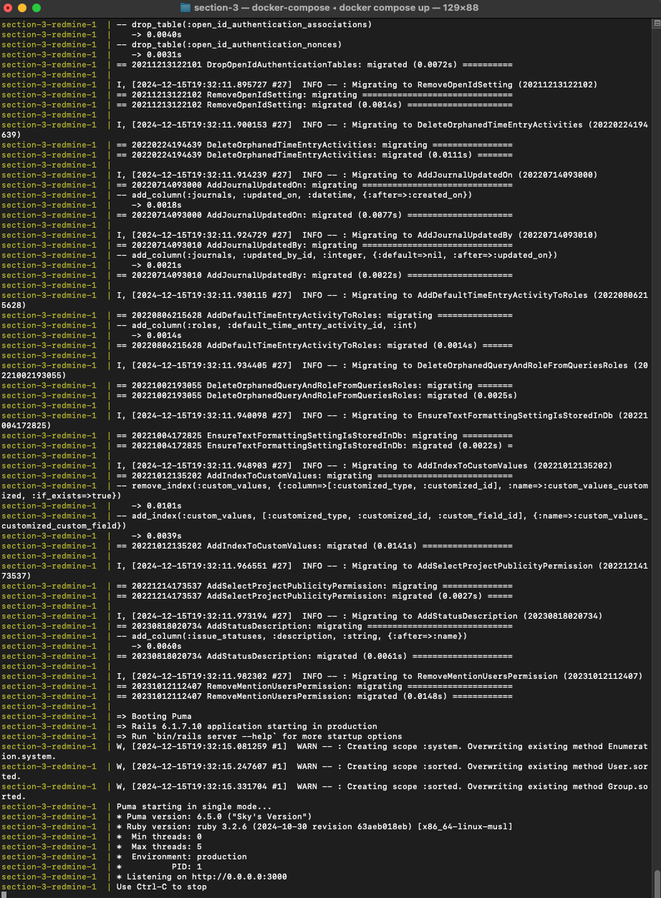

6. docker compose z sqlite #3
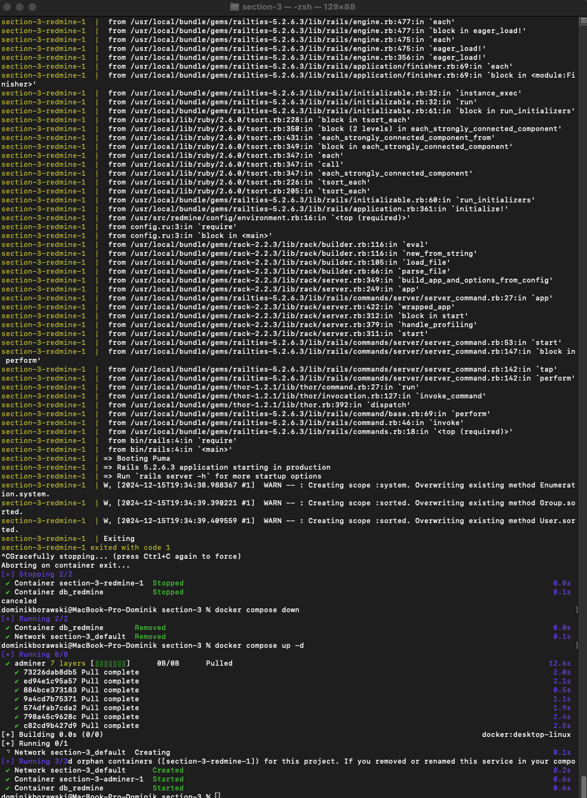

7. System do zarządzania sqlite
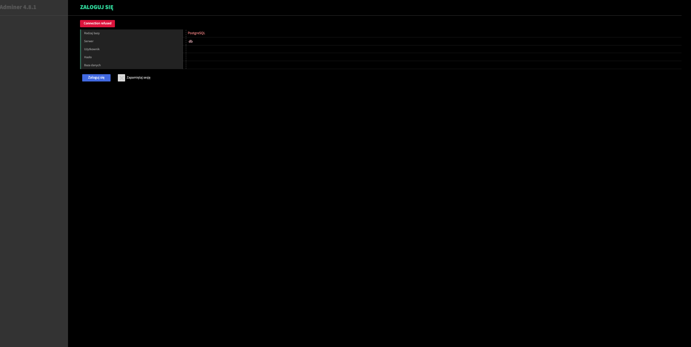

## section-4

1. Docker compose z node js #1
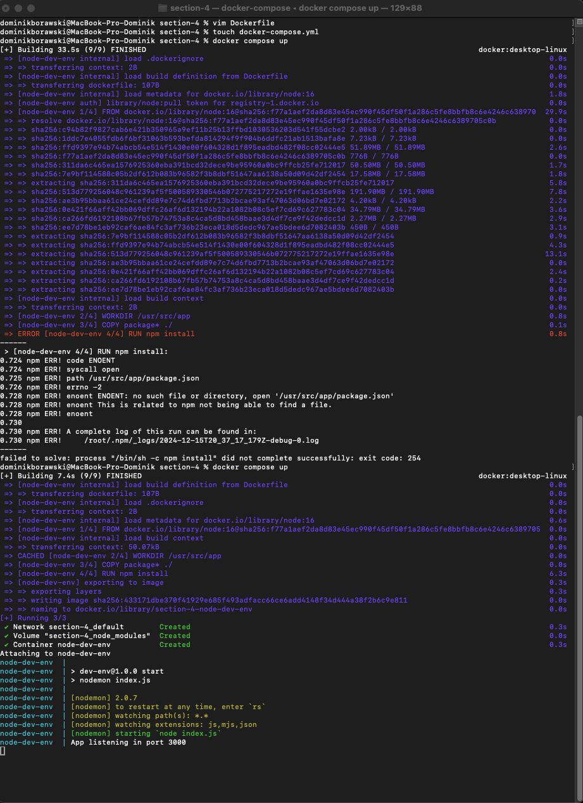

2. Docker compose z node js #2
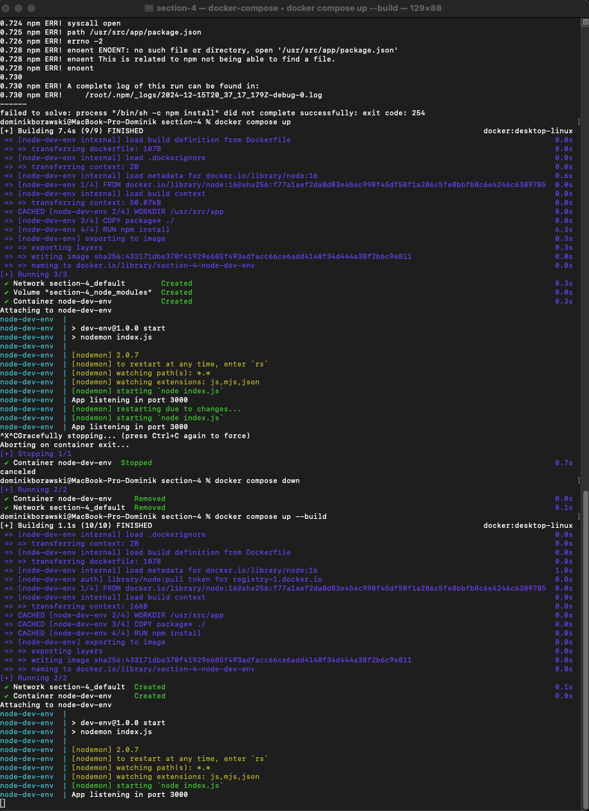

3. Podgląd działania w przeglądarce

