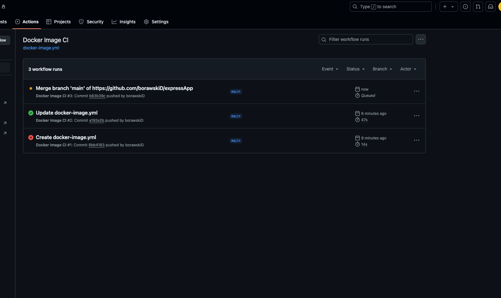
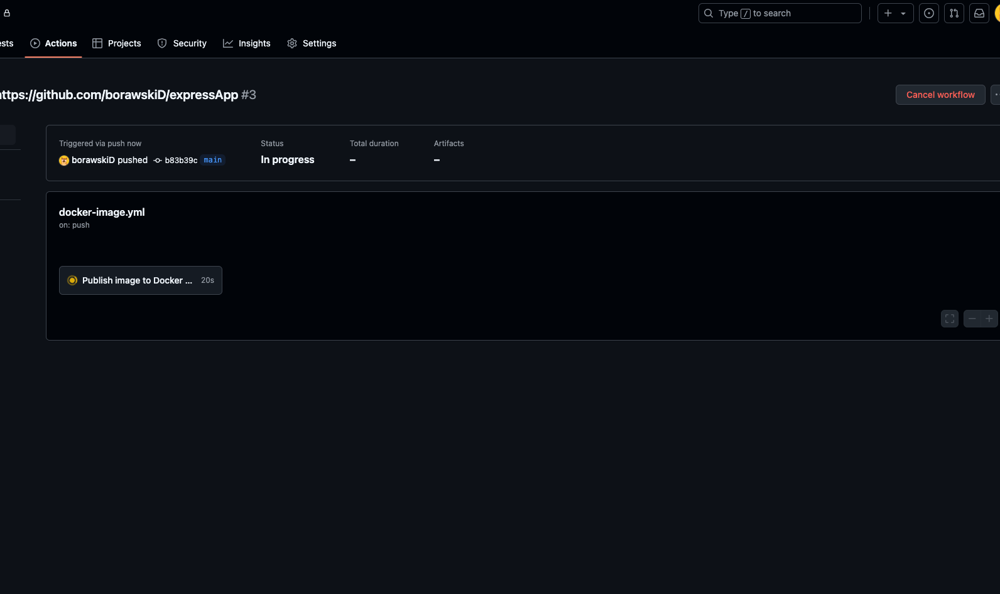
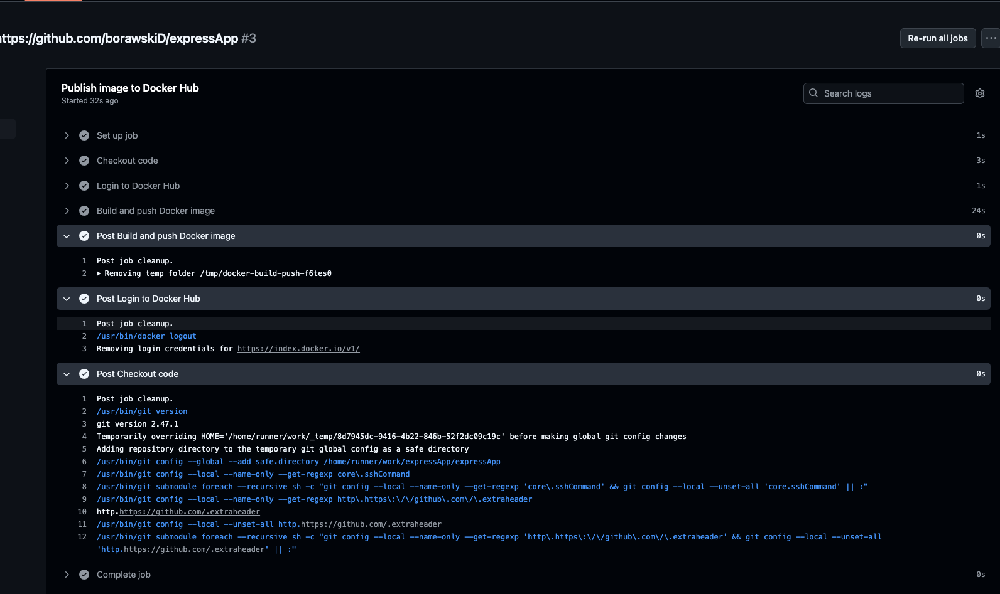
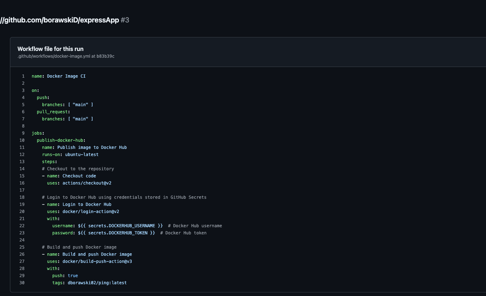
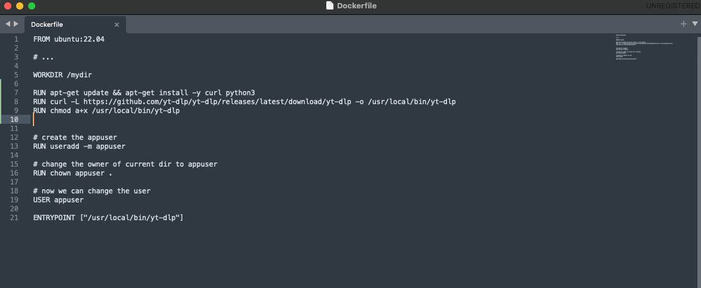
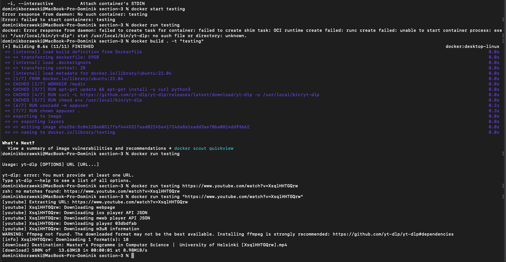
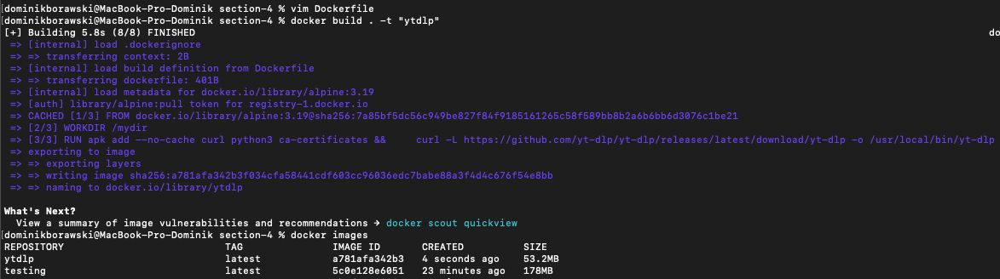

Najlepsza część laboratoriów - zwłaszcza wprowadzenie do CI/CD. Krok po kroku pokazane jak zrealizować prosty proces wdrożenia, bardzo popularny w profesjonalnym programowaniu.
## express-app

1. Budowa github actions (CI/CD) - statusy

2. Podgląd obecnego statusu

3. Podgląd na żywo przebiegu CI/CD

4. Cały kod:

## section-3

1. Dockerfile z userem bez uprawnień roota:

2. Weryfikacja działania aplikacji:

## section-4

1. Odchudzenie obrazu poprzez wykorzystanie odchudzonego linuxa (alpine):

